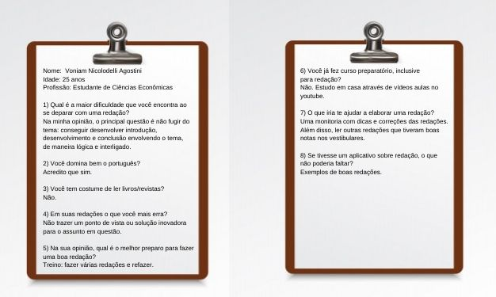
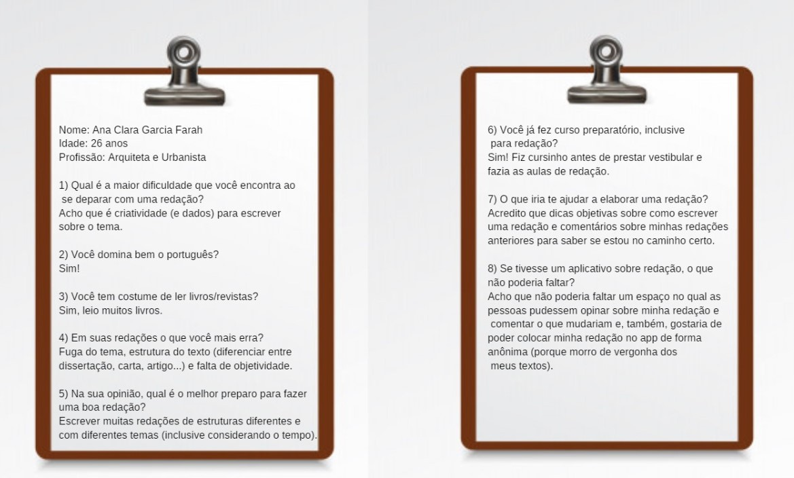
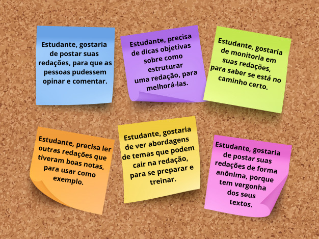
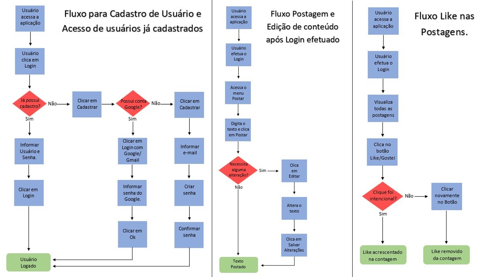

 

## Índice

- [1. Prefácio](#1-prefácio)
- [2. Conhecendo Nossos Usuários](#2-conhecendo-nossos-usuários)
- [3. Definição de Produto](#3-definição-de-produto)
- [4. Fluxograma](#4-fluxograma)
- [5. Interface do Usuário](#5-interface-do-usuário)
- [6. Teste de Usabilidade](#6-teste-de-usabilidade)
- [7. KAT - Redações](#7-KAT-redações)
- [8. Colocando a Mão na Massa](#8-colocando-a-mão-na-massa)
- [9. Considerações Finais](#9-considerações-finais)
- [10. Autoras](#11-autoras)

---

## 1. Prefácio

A proposta do projeto é construir uma Rede Social sobre quaisquer assuntos, onde terá que permitir à qualquer usuário criar uma conta de acesso, logar-se com ela, criar, editar, deletar e dar likes em publicações. 

Ao se deparar com essa ideia, e após algumas reuniões e pesquisas com o grupo, decidimos criar um aplicativo, voltado à elaboração de redações. Visto que, a maioria das pessoas sentem dificuldades em como estruturar, diferenciá-la e até mesmo falar sobre o tema proposto.  

A redação hoje em dia conta muitos pontos nas provas do vestibular, concurso público e até no processo seletivo de uma empresa. E saber fazer uma boa redação para garantir uma vaga, é fundamental. 

K.A.T. é o aplicativo que faltava, para descomplicar a vida dos usuários, onde poderão postar suas redações, refazer, treinar, pedir ajuda, curtir e compartilhar dicas de melhorias seja de professores, como de amigos da rede. 

## 2. Conhecendo nossos Usuários 

### Principais Usuários 

Para todas as pessoas que irão prestar vestibular, concurso público e para todos aqueles que queiram se aperfeiçoar em suas redações de forma objetiva para fins profissionais e pessoais. E também professores que possam compartilhar dicas para melhorar as redações e comentar qualquer dúvida existente na rede. 

### Problemas 

Estudantes tem dificuldades em elaborar suas redações, fugindo do tema, não conseguem estruturar de forma correta, lógica e interligada. Faltam muitas dicas de temas e objetividade nos assuntos, além disso gostariam que suas redações fossem comentadas para saber onde estão errando ou se estão no caminho certo. 

## 3. Definição de Produto 

Alguns métodos de UX foram utilizados para o desenvolvimento do aplicativo: 

:small_blue_diamond: Personas criadas; 

:small_blue_diamond: Personas validadas com as entrevistas realizadas; 

:small_blue_diamond: História de usuário. 

### Personas 

 

### Entrevistas 

### História do Usuário 

 

:pushpin: **História de Usuário 1 -** “Estudante, gostaria de postar minhas redações, para que as pessoas pudessem opinar e comentar.” 

**Critérios de Aceitação:** 

:small_blue_diamond: Página de cadastro na plataforma;

:small_blue_diamond: Página para login na plataforma (e-mail e senha);

:small_blue_diamond: Página onde o usuário possa escrever uma publicação (input de texto e um botão enviar postagem);

:small_blue_diamond: Página onde todos da plataforma possam visualizar a publicação postada pelo usuário;

:small_blue_diamond: Input que permita a outros usuários comentarem a publicação e darem likes;

:small_blue_diamond: Função que permita ao usuário fazer logout do app.

:pushpin: **História de Usuário 2 -** “Estudante, precisa de dicas objetivas sobre como estruturar uma redação para melhorá-las.” 

**Critérios de Aceitação:** 

:small_blue_diamond: Página de cadastro na plataforma; 

:small_blue_diamond: Página para login na plataforma (e-mail e senha);  

:small_blue_diamond: No input de texto, quando o usuário for criar uma publicação, ter um filtro que sinalize que aquele post é relacionado à estrutura de redação.

:small_blue_diamond: O sinalizador irá aparecer no post > página de publicações. 

:small_blue_diamond: Função que permita ao usuário fazer logout do app. 

:pushpin: **História de Usuário 3 -** “Estudante, gostaria de monitoria em suas redações para saber se está no caminho certo.”  

**Critérios de Aceitação:**

:small_blue_diamond: Página de cadastro na plataforma; 

:small_blue_diamond: Página para login na plataforma (e-mail e senha);  

:small_blue_diamond: Página onde o usuário possa escrever uma publicação (input de texto e um botão enviar postagem); 

:small_blue_diamond: Página onde todos da plataforma possam visualizar a publicação postada pelo usuário; 

:small_blue_diamond: Input que permita a outros usuários comentarem a publicação e darem likes; 

:small_blue_diamond: Função que permita ao usuário fazer logout do app. 
 
:pushpin: **História de Usuário 4 -** “Estudante, precisa ler outras redações que tiveram boas notas, para usar como exemplo.” 

**Critérios de Aceitação:**

:small_blue_diamond: Página de cadastro na plataforma; 

:small_blue_diamond: Página para login na plataforma (e-mail e senha);  

:small_blue_diamond: No input de texto, quando o usuário for criar uma publicação, ter um filtro que sinalize que aquele post é uma redação. 

:small_blue_diamond: O sinalizador irá aparecer no post > página de publicações; 

:small_blue_diamond: Página onde todos da plataforma possam visualizar publicações de outros usuários; 

:small_blue_diamond: Visualizar as curtidas (contagem de likes) para determinado post; 

:small_blue_diamond: Poder ordenar por curtidas +++; 

:small_blue_diamond: Função que permita ao usuário fazer logout do app. 

:pushpin: **História de Usuário 5 -** “Estudante, gostaria de visualizar abordagens de temas que podem cair na redação, para poder separar e treinar.” 

**Critérios de Aceitação:**

:small_blue_diamond: Página de cadastro na plataforma; 

:small_blue_diamond: Página para login na plataforma (e-mail e senha);  

:small_blue_diamond: No input de texto, quando o usuário for criar uma publicação, ter um filtro que sinalize que aquele post é uma sugestão de temas para redação de vestibular; 

:small_blue_diamond: O sinalizador irá aparecer no post > página de publicações;

:small_blue_diamond: Página onde todos da plataforma possam visualizar publicações de outros usuários; 

:small_blue_diamond: Função que permita ao usuário fazer logout do app. 

:pushpin: **História de Usuário 6 -** “Estudante, gostaria de postar suas redações de forma anônima, porque tem vergonha de seus textos.” 

**Critérios de Aceitação:** 

:small_blue_diamond: Página de cadastro na plataforma; 

:small_blue_diamond: Página para login na plataforma (e-mail e senha);  

:small_blue_diamond: No input de texto, quando o usuário for criar uma publicação, ter um filtro que sinalize que ao postar, o usuário não quer que apareça seus dados no documento; 

:small_blue_diamond: Post ir para a página de publicações com perfil anônimo (imagem de anônimo e nome User, por exemplo); 

:small_blue_diamond: Página onde todos da plataforma possam visualizar publicações de outros usuários; 

:small_blue_diamond: Função que permita ao usuário fazer logout do app. 

### Definição de pronto 

**Criação e login de conta de usuário** 

Login com Firebase: 

:small_blue_diamond: Para o login e postagens na timeline, o uso de Firebase Authentication e Cloud Firestore.

:small_blue_diamond: O usuário deve poder criar uma conta de acesso ou autenticar-se com conta de e-mail e senha e também com uma conta do Google. 

Validações: 

:small_blue_diamond: Somente usuários com contas válidas têm acesso permitido. 

:small_blue_diamond: Não haver usuários repetidos. 

:small_blue_diamond: A conta do usuário deve ser um e-mail válido. 

:small_blue_diamond: O que o usuário digita no campo de senha (input) deve ser secreto. 

Comportamento: 

:small_blue_diamond: Quando o formulário de registro ou login é enviado, ele deve ser validado. 

:small_blue_diamond: Se houver erros, mensagens descritivas devem ser exibidas para ajudar o usuário. 

**Timeline:**  

Validações: 

:small_blue_diamond: Ao publicar, deve ser validado se há conteúdo no input. 

Comportamento: 

:small_blue_diamond: Ao recarregar o aplicativo, é necessário verificar se o usuário está logado antes de exibir o conteúdo.

:small_blue_diamond: Conseguir publicar um post.

:small_blue_diamond: Poder dar e remover likes em uma publicação. Máximo de um por usuário. 

:small_blue_diamond: Visualizar contagem de likes. 

:small_blue_diamond: Poder excluir uma postagem específica.

:small_blue_diamond: Solicitar confirmação antes de excluir um post. 

:small_blue_diamond: Ao clicar em editar um post, você deve alterar o texto para um input que permite editar o texto e salvar as alterações. 

:small_blue_diamond: Ao salvar as alterações, você deve voltar ao texto normal, mas com a informação editada. 

:small_blue_diamond: Ao recarregar a página, poder ver os textos editados. 

**Testes**

:small_blue_diamond: Passar de 70% a 100% nos testes unitários; 

:small_blue_diamond: Responsividade;

:small_blue_diamond: Teste de experimentação de aplicativo com os usuários.

## 4. Fluxograma

Através das histórias de usuário, conseguimos montar um fluxo de como seria o processo de criação de conta, login e publicação do usuário em nossa aplicação.

## 5. Interface de Usuário  

Com base nas entrevistas e no fluxograma do projeto criamos os primeiros protótipos da aplicação.

## 6. Teste de Usabilidade 

Após os primeiros testes foi visualizado várias melhorias na aplicação, cito aqui algumas delas:
- Página Login: 
    - Não necessidade de um campo a mais para informar o titulo do campo, podendo ser feito no próprio input de texto.
    - A logo da aplicação e a descrição do mesmo após o Login, uma vez que nossos úsuarios ao entrar na aplicação já queira efetuar o Login. Deixando a explicação abaixo para os novos usuários verificarem utilizando o scroll de tela.
    - O próprio botão do Google já estar com a informação de "Entrar com Google", não necessitando mais um paragrafo para o mesmo.

- Página Cadastro:
    - Removido também a descrição dos campos e utilizado o próprio input para o mesmo.

- Página Publicar
    - O menu para navegar entre Publicar e Publicações foi remanejado para a mesma linha do botão de sair.

- Página Publicações
    - Foi utilizado o mesmo menu da Página Publicar, para navegações entre as página e o botão sair, deixando as duas páginas mais padronizadas.
    - Acrescentado um botão de "Não gostar" na aplicação.
    - Limitado a 1 por usuário o "Gostar" e "Não Gostar" da publicação.
    - Removido a informação da tela "Mais Recente" uma vez que já é ordenado as postagens pela data da mesma, deixando sempre a mais recente no topo.
    - O botão editar foi alterado por uma imagem assim como o botão "Gostar" e "Sair", deixando intuitivamente o que cada botão faz.
    - Criado um botão para deletar a postagem.

## 7. KAT - Redações 

KAT - Redações é uma aplicação que permite seu usuário a postar informações, textos e dicas para os demais usuários visualizarem.
Ao fazer a postagem você poderá editá-la ou até mesmo exclui-lá se não foi o que você desejava publicar. Os demais usuários poderão curtir ou não curtir suas publicações.

[colocar um gif da aplicação]

## 8. Colocando a Mão na Massa  

Desenvolvido em HTML5, CSS3 e Vanilla JavaScript, utilizando funcionalidades do Firebase. Utilizando o conceito Mobile First.

Para utilizar nossa aplicação você pode acessá-la através do link: "KAT - Redações"(colocar o link do hosting aqui)

Esperamos que se divirta e que encontre uma rede disposta a lhe ajudar. 

[colocar aqui outro gif da aplicação]

## 9. Considerações Finais 

Neste projeto aprendemos a lidar com ferramentas diferentes e a comunicação do projeto com um banco de dados externo, o que trouxe uma complexidade diferente e desafios ainda não vividos.

Além do trabalho em trio, desenvolvendo muito mais a comunicação entre as pessoas, o trabalho em equipe, e a utilizar as ferramentas de um modo muito mais próximo ao utilizado em grandes equipes. 

Mesmo com todos esses desafios, acredito que foi uma experiência muito rica e divertida.

Agradecemos muito a Laboratória por nos desafiar sempre a aprender cada dia mais, aos colegas de trio, e de squad, que foram fundamentais nesse processo, aos mentores e suas maravilhosas oficinas e dicas, e não menos importante aos nosso familiares e amigos, que nem sempre podem nos ajudar com dicas técnicas mas sempre nos incentivam, nos apoiam e estão dispostos a ouvir nossos desabafos.

## 10. Autoras 

:small_blue_diamond: Alessandra Alves | [GitHub - Alessandra](https://github.com/ale-alves)

:small_blue_diamond: Kauana Agostini  | [GitHub - Kauana](https://github.com/kauanaagostini)

:small_blue_diamond: Thaís Alencar | [GitHub - Thaís](https://github.com/alencartha) 
